# Walkthrough — one erasure request, end to end

> **STATUS: skeleton awaiting evidence.** Every block marked `EVIDENCE` is a placeholder
> for output from a real `make walkthrough` run against a deployed stack. Nothing in this
> file may describe behaviour that has not been observed — the repo's entire argument is
> that its claims can be checked, and a narrative written ahead of its evidence is the
> defect class [VALIDATION.md](VALIDATION.md) exists to catch. Delete a section rather
> than write it from expectation.

This is the reader's path through the system: one subject asks to be deleted, and the
platform answers in a way that can be audited afterwards. [ARCHITECTURE.md](ARCHITECTURE.md)
explains how it is built; this explains what it *does*.

---

## 1. The shape of the problem

Deleting a person from eight systems is not eight deletes. It is a distributed transaction
against services that fail differently, some of which legally cannot forget, running under
a statutory clock, where the failure mode nobody sees is the one that matters: data left
behind that no one reports.

Three properties follow, and they drive every design decision below.

- **A miss is invisible.** A deletion that skips a system looks exactly like one that
  succeeded. This is why recall is a hard gate at 1.0 and not a metric to watch
  ([ADR-008](adr/ADR-008-recall-1.0-hard-gate.md)).
- **Rollback is a breach.** Once phase 3 begins, a compensating transaction would recreate
  the subject's data. So phase 3 never compensates — it retries or it stops
  ([ADR-002](adr/ADR-002-three-phase-split-recovery.md)).
- **Some data cannot be deleted.** WORM archives and suppression lists legitimately retain
  things. The system discloses residuals rather than hiding them
  ([ADR-007](adr/ADR-007-crypto-shredding-for-worm.md)).

## 2. The one diagram to read first

Recovery semantics lead because they are what separates this from a script. The other
three — [reference architecture](diagrams/out/01-reference-architecture.svg),
[the three-phase saga](diagrams/out/02-three-phase-saga.svg), and
[the approval flow](diagrams/out/03-approval-flow.svg) — support it.

## 3. The arc

<!-- EVIDENCE: the `make walkthrough` transcript, split across the stages below. Keep the
     real output verbatim, including timings. Paraphrased console output is fabricated
     evidence. -->

| Stage | What happens | Evidence |
|---|---|---|
| Intake | The request arrives and a saga thread is created | ⬜ |
| Discovery | A read-only agent finds the subject across eight systems | ⬜ |
| Manifest | The plan is canonicalised, digested and signed | ⬜ |
| Approval | The saga pauses; a human decides | ⬜ |
| Phase 1 — soft delete | Reversible, per participant | ⬜ |
| Phase 2 — grace window | The subject can still object | ⬜ |
| Phase 3 — hard delete | Irreversible. Never compensated | ⬜ |
| Verify | Residuals are counted and disclosed | ⬜ |
| Sweep T+7 / T+30 | Resurrection check | ⬜ |
| Certificate | What was deleted, what remains, and why | ⬜ |

## 4. The four moments worth stopping on

These are the demonstrations. Each needs its own artefact, and each is a claim this
platform makes that a simpler one cannot.

### 4.1 The Lambda returns, and nothing is running

The saga pauses at the approval gate for up to 30 days. No compute is held, no polling
loop, no state outside the checkpointer. The invocation *returns* — and the erasure is
still in flight.

<!-- EVIDENCE: the transcript section showing the invocation completing while the thread
     stays open, plus `make threads` showing what it is waiting for. This is the single
     most interesting thing the system does and the hardest to believe without output. -->

### 4.2 The injection is denied — and the tool was never offered

Discovery reads subject-controlled content, so it is injection-reachable by design. Its
defence is not detection; it is that it holds no mutating tool.

**Two artefacts, not one.** The policy-deny log line proves the request was refused. The
`tools/list` response proves the tool was never in the model's choices to begin with.
Prevention and evidence are different claims and both are needed.

<!-- EVIDENCE: (a) the Cedar deny log line; (b) the tools/list response. -->

### 4.3 A participant reports PARTIAL honestly

`notify-suppression` retains an email hash — the suppression list is what stops the
subject being re-contacted, so deleting it would harm them. `analytics-lake` keeps Iceberg
rows until snapshot expiry.

<!-- EVIDENCE: the verify output showing PARTIAL with a populated residual, and the
     certificate section that discloses it to the subject. -->

### 4.4 The KMS finding that moved the shred down a layer

<!-- EVIDENCE: the 7-day-window finding. See ADR-007 and the VALIDATION entry; this
     section should state what was believed, what the service actually does, and what
     changed as a result. -->

## 5. What it costs

<!-- EVIDENCE: Cost Explorer figures for (a) one production-shaped run with real Bedrock,
     (b) 24h idle. The claim under test is that an idle stack costs cents and Bedrock
     tokens dominate an active one. Record the numbers or drop the claim. -->

## 6. What this got wrong

The build history is part of the argument, not laundry to hide. Three decisions changed on
the record — framework (009 → 011 → 013), durability (003 → 014 → 016), participants
(012 → 017) — and the superseded ADRs are kept deliberately.

[VALIDATION.md](VALIDATION.md) is the honest ledger: every control that turned out not to
work, how it was found, and what now backs it. Several were found only by deploying, which
is the point of having a deployed gate at all.

<!-- EVIDENCE: the findings table, or a curated selection with the full table linked. -->

---

## Capture checklist

Run against a deployed stack, in this order. Save raw output — not screenshots of text.

- [ ] `make walkthrough` — full transcript
- [ ] `make threads` — while the saga is paused at approval
- [ ] The Cedar deny line and the `tools/list` response
- [ ] CloudWatch dashboard `asdp-<stage>-erasure` — and confirm no alarm reads
      `INSUFFICIENT_DATA`
- [ ] Cost Explorer — the run, and 24h idle
- [ ] `make destroy-dev` — and confirm nothing is left behind
