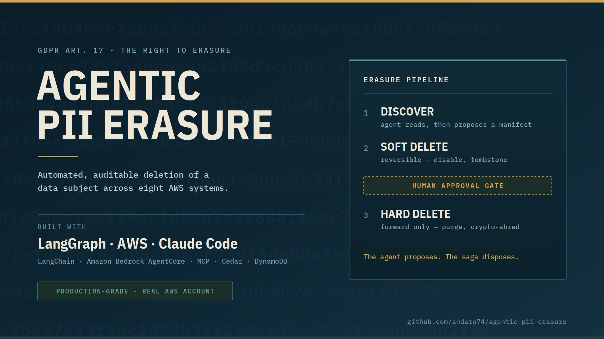
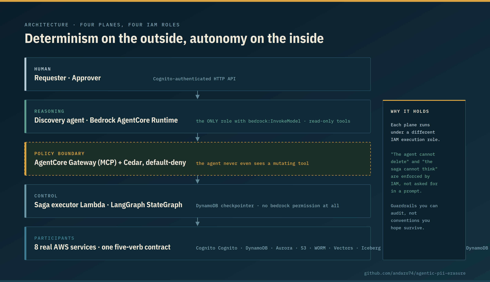
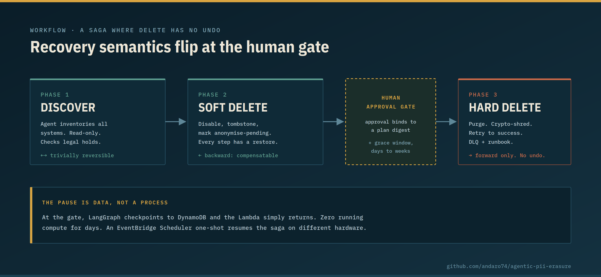
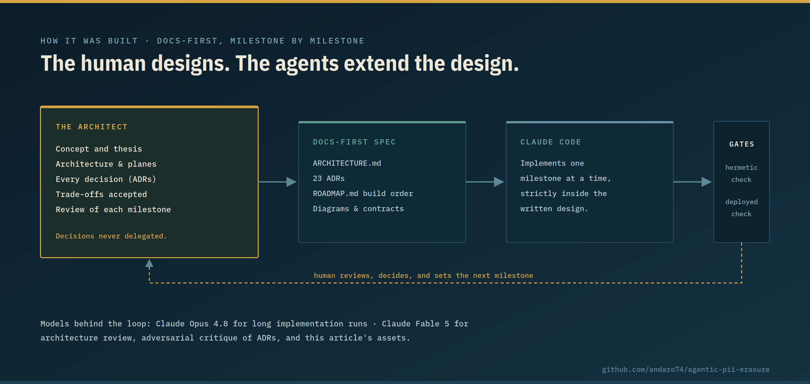
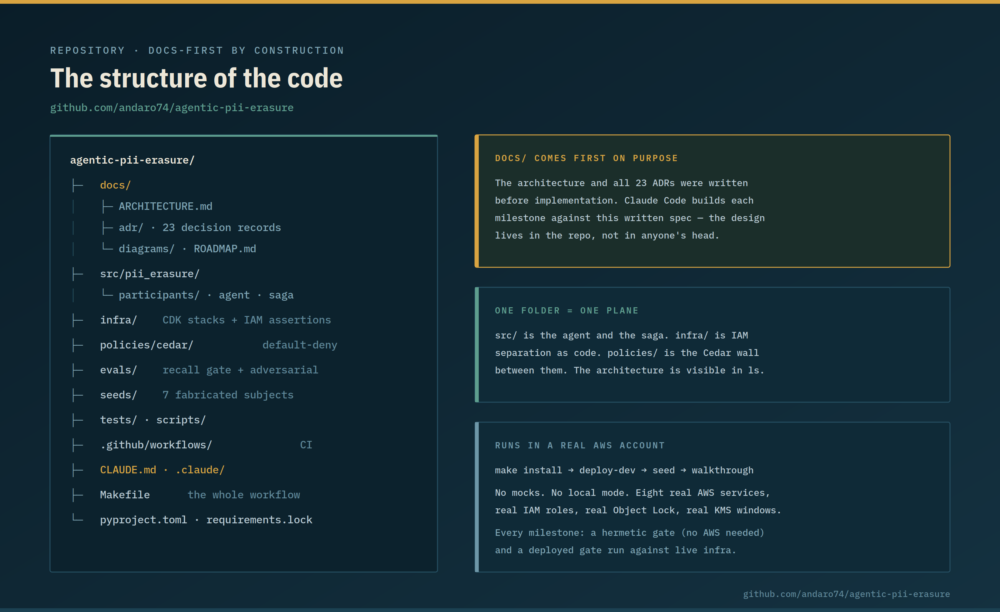

# I Built an Agentic PII Erasure Platform with LangGraph and AWS

### It's production-grade, it runs in a real AWS account — and the agent never deletes anything. Here's what it taught me about putting AI agents into regulated enterprise processes, and about building *with* agents, not just building agents.

Cover image — [open full size](https://raw.githubusercontent.com/andaro74/agentic-pii-erasure/main/docs/article/cover-1920x1080.png) · [SVG source](https://raw.githubusercontent.com/andaro74/agentic-pii-erasure/main/docs/article/cover-1920x1080.svg)

---

"Delete this user everywhere" sounds like one line of code. It is actually one of the hardest distributed-systems problems an enterprise owns: a legally mandated transaction across systems that will never agree on anything, where nobody has an accurate map of where the data lives, where success is binary — deleting 7 of 8 systems isn't 87% done, it's a reportable breach — and where the operation has **no undo**.

That made it the perfect proving ground for a question I wanted to answer with working code, not slides: **where does an AI agent actually belong inside a regulated enterprise process?**

The answer I landed on fits in one sentence:

> **The agent proposes. The saga disposes.**

I built [Agentic PII Erasure](https://github.com/andaro74/agentic-pii-erasure) to prove that sentence out — and I built it as a **production-grade system running in a real AWS account**, not a notebook demo. There is no local mode and there are no mocks: the erasure saga executes against eight real AWS services, under real IAM roles, hitting real constraints like S3 Object Lock retention and KMS deletion windows. If a design decision was wrong, real infrastructure said so.

Here's what it looks like, and what I learned.

---

## The design: give the agent exactly one job

Agents are brilliant where the search space is open-ended, and dangerous where actions are irreversible. So the architecture gives non-determinism exactly one home: **discovery**. The agent hunts for everywhere a person's data lives — the part no static system does well, because CMDBs are stale and lineage tooling never covers everything.

The agent then produces a **signed, versioned Deletion Manifest** — and its work is done. It never calls a deletion tool. Execution is deterministic replay of that manifest by LangGraph, running in Lambdas whose IAM role has no permission to invoke a model at all, gated by Cedar policy the agent can't reach.

The two planes and the IAM boundary between them — [open full size](https://raw.githubusercontent.com/andaro74/agentic-pii-erasure/main/docs/article/01-architecture-planes.png)

The detail I'd highlight for both audiences: the separation isn't a prompt instruction or a convention. It's IAM. "The agent cannot delete" and "the executor cannot think" are properties a security team can audit, because each plane is a different execution role. When a regulator asks *why was this record deleted*, the answer is a signed artifact and a named approver — never "the model decided."

---

## The workflow: a human gate where the physics change

Deletion breaks the classic saga pattern, because the saga pattern assumes every action has an inverse. `DELETE` doesn't. So the workflow runs in three phases with **different recovery semantics**, and a human approval gate sits exactly where those semantics flip:

The three-phase workflow and where recovery flips from backward to forward — [open full size](https://raw.githubusercontent.com/andaro74/agentic-pii-erasure/main/docs/article/02-erasure-workflow.png)

Before the gate, everything is reversible — soft deletes, tombstones, disables — so recovery runs *backward* via compensation. After the gate, there is no undo, so recovery runs *forward only*: retry until it succeeds, or escalate to a human with a runbook. The approval itself binds to a cryptographic digest of the plan, so if the plan changes by one byte after approval, the approval is void.

For executives, this is the transferable pattern: **put the human gate at the point of irreversibility, and make the approval bind to the exact plan being approved.** That pattern applies to payments, access grants, contract execution — any process you'd like to automate but can't afford to automate blindly.

---

## Five lessons that survived contact with reality

**1. Constrain the agent structurally, not conversationally.** One seeded test subject carries a prompt-injection payload in their profile bio. The system passes that test not because the model "resists" — but because the deletion tool was never in the agent's tool list, and policy denies and logs anyway. Guardrails in a prompt are advisory. Guardrails in IAM and Cedar are facts.

**2. Real infrastructure will overrule your design — let it.** Building against real AWS services changed the architecture twice. KMS key deletion has a 7-day minimum window, which would blow a one-month statutory deadline — so crypto-shredding moved down a layer. And S3 Vectors has no delete-by-query, which turned "keep the subject identifier alive until last" from a nice idea into a hard requirement. No simulation would have surfaced either.

**3. Some systems can't delete — design for honest residue.** A WORM compliance archive has no delete API, for anyone, including root. An email suppression list must *keep* an entry to honor an opt-out. The system makes silent partial success unrepresentable: a participant that can't fully delete has to say so, and the audit trail discloses it.

**4. Pick the metric that matches the obligation.** For legal erasure, recall is the SLO and precision is a convenience. A false positive costs a reviewer thirty seconds; a false negative is caught by nobody. The build fails below recall 1.0. There's no principled threshold beneath that for a legal duty.

**5. Serverless pauses have to live in data.** A saga spends days parked at the approval gate and seconds doing work. Nothing serverless can hold that pause as a running process, so the pause became a LangGraph checkpoint in DynamoDB — a live erasure request with zero running compute anywhere in the account, resumed later by a scheduler on different hardware. The checkpointer is forced to be the system of record, and idle cost drops to cents.

---

## How it was built: I designed, the agents extended

I want to be precise about the division of labor, because it's the part I get asked about most.

The concept, the architecture, the plane separation, the three-phase saga, and every recorded decision — 23 ADRs' worth of trade-offs — are mine. I made the calls, including the uncomfortable ones, like giving up hermetic CI to test against real services, and swapping OpenSearch for S3 Vectors purely on cost. **The agents were an extension of my design, not the source of it.**

What the agents did was multiply my throughput inside that design. The repo is docs-first: architecture and decision records were written before implementation, and Claude Code built the system milestone by milestone against that written spec — with every milestone gated by a hermetic check that runs without AWS, and a deployed check I run and review myself.

The division of labor: human design, agent throughput — [open full size](https://raw.githubusercontent.com/andaro74/agentic-pii-erasure/main/docs/article/03-human-designs-agents-extend.png)

You can see this philosophy in the shape of the repository itself. `docs/` — the architecture spec and all 23 ADRs — comes first because it *was* first. `src/` holds the agent and the saga; `infra/` expresses the IAM plane separation as CDK code with assertions; `policies/cedar/` is the default-deny wall between them. The architecture is visible in `ls` before you read a line of Python. And the `Makefile` is the entire operational surface: `make install && make deploy-dev && make seed && make walkthrough` stands up the full system in your own AWS account.

The architecture is visible in `ls` before you read a line of Python — [open full size](https://raw.githubusercontent.com/andaro74/agentic-pii-erasure/main/docs/article/04-repo-structure.png)

I used Claude Opus 4.8 for the long implementation runs, and Claude Fable 5 for architecture review and adversarial critique of the ADRs — having a model argue *against* a decision record before committing to it caught weak reasoning cheaply.

Writing the docs first turned out to be the whole trick. It's what let the agents work autonomously for long stretches without drifting, because the design wasn't in my head — it was in the repo, versioned, where the agent could read it. The same property that makes a codebase agent-friendly makes it auditor-friendly and new-engineer-friendly. That's not a coincidence.

---

## The takeaway

Agentic AI is ready for regulated enterprise processes — but not as an autonomous actor. It's ready as a **proposer inside a deterministic, policy-gated, human-approved system**, where its creativity is spent on the open-ended part and structurally locked out of the irreversible part.

This isn't a thought experiment — it's a production-grade system you can deploy into your own AWS account today with four make commands. The repo is MIT-licensed, and its ADRs document every fork in the road, including the unresolved ones: **github.com/andaro74/agentic-pii-erasure**

If you're wrestling with where agents belong in your own processes — or you disagree with a decision in the ADRs — I'd genuinely like to hear it.

---

*#AgenticAI #GDPR #AWS #LangGraph #LangChain #ClaudeCode #EnterpriseArchitecture #Privacy*
